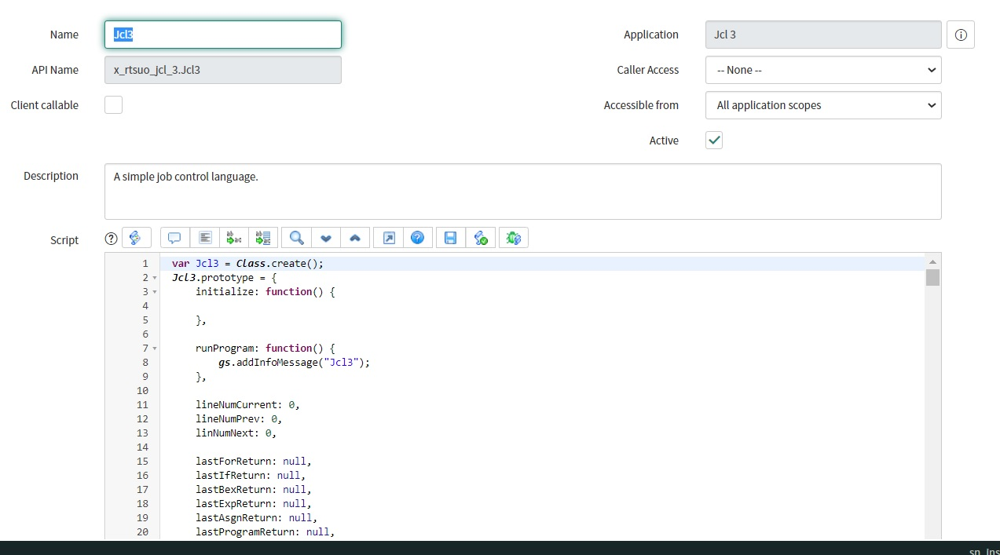

# JsonPL Version 0.5.1 - The Json Programming Language

## JsonPL Project Files
A description of the project's current contents.

Main Sections:

[JsonPL General Use Case](#jsonpl-general-use-case)

[JsonPL ServiceNow Use Case](#jsonpl-servicenow-use-case)

[JsonPL Details](#jsonpl-details)

[JsonPL Objects](#jsonpl-objects)

[JsonPL Examples](#jsonpl-examples)

<pre>
EXEC4.JS:   The JsonPL main class and interpreter, functional.
TEST4.HTML: An html file that tests JsonPL objects, functional.
IDE4.JS:    JsonPL IDE JS, very early stages, not functional.
IDE4.HTML:  JsonPL JS, very early stages, not functional.
</pre>

## JsonPL General Use Case
In the following code snippet we're looking at a hypothetical example where the data and the JsonPL code are being brought down from AJAX calls. Notice that in this case the executable code is data driven along with the data.

<pre>
//psuedo-code
function test(dataFromAjax, jplCodeFromAjax) {
   console.log("test method");
   var jpl = new jsonPlState();
   jpl.program = jplCodeFromAjax;
   jpl.program.vars[0].val.v = dataFromAjax[0];
   jpl.program.vars[1].val.v = dataFromAjax[1];
   var tmp = jpl.runProgram();
   return tmp.val.v;
}
</pre>

## JsonPL Details
Some details about the scripting language as it exists in version 0.5.1.

1. JsonPL is a typed language supporting the following basic data types, int, float, bool, and string.
2. JsonPL supports the following conventions, variable declaration, argument definition, assignment, boolean expressions, numeric expressions, if statements, for loops, and return statements.
3. JsonPL inherently supports late binding and easy transmission of programs as text.

## JsonPL Objects
In this section we'll take a look at all of the different JSON objects supported by JsonPL. Links to JsonPL object definitions are as follows.

[Class Object](#class-object)

[Ret Quasi Object](#ret-quasi-object)

[Var Object](#var-object)

[Arg Object](#arg-object)

[Val Object](#val-object-sub-object)

[Ref Object](#ref-object-argument-object)

[Const Object](#const-object-argument-object)

[Call Object Standard](#call-object-argument-line-object)

[Call Object System Function](#call-object-system-function-call)

[Return Object](#return-object-line-object)

[Op Objects](#op-objects-special-operator-object)

[Asgn Object](#asgn-object-line-object)

[Func Object](#func-object)

[Bex Object](#bex-object-argument-object)

[Exp Object](#exp-object-argument-object)

## JsonPL Examples
A list of example snippets showing code and output associated with different JsonPL objects.

[Example 1: Class Variable Reference](#example-1-class-variable-reference)

[Example 2: Assignment](#example-2-assignment)

[Example 3: Boolean Expressions](#example-3-boolean-expressions)

[Example 4: Numeric Expression](#example-4-numeric-expression)

[Example 5: Function Call](#example-5-function-call)

[Example 6: If Statement](#example-6-if-statement)

[Example 7: For Loop](#example-7-for-loop)

[Example 8: Call Statement](#example-8-call-statement)

[Example 9: Full Program Run 1](#example-9-full-program-run-1)

[Example 10: Full Program Run 2](#example-10-full-program-run-2)

[Example 11: Full Program Run 3](#example-11-full-program-run-3)

### Class Object
The class object is the highest level object and is used to define a class or a program. A class is a module of code that contains functions and variables.
A program is a class that has a call attribute defined.

<pre>
var code = {
   "sys": "class",
   "name": "Program1",
   "call": { ... },
   "vars": [
      ...
   ],
   "funcs": [
      ...
   ],
   "ret": {
      "sys": "val",
      "type": "bool",
      "v": false
   }
}
</pre>

<pre>
Object Definition:  
{
   "sys": "class",
   "name": "some name",
   "call": {call},
   "vars": [var],
   "funcs": [func],
   "ret": {val}
}
</pre>

The class object is denoted by the sys attribute value, "sys": "class". The object supports a name attribute which designates the name of the class. If this class is executeable, a program, then the call attribute will be set with a valid call object. The class variables are defined in the vars section while the associated class functions are defined in the funcs attribute. Lastly the ret attribute defines the return type of this class when it's executed as a program. The next object we'll look at is the var object.

### Ret Quasi Object
The ret object is a quasi object. Its only purpose is as a placeholder that denotes the return type of a class or function.

<pre>
{
   "sys": "val",
   "type": "bool",
   "v": false
}
</pre>

Note that this object is actually just a val object. I'm only mentioning it here as a quasi object because of how it functions as a placeholder.

### Var Object
The var object is used to define variables that are associated with a class or a function. An example with two variable entries is shown here.

<pre>
{
   "sys": "var",
   "name": "tmp1",
   "val": {
      "sys": "val",
      "type": "int",
      "v": 5
   }
},
{
   "sys": "var",
   "name": "tmp2",
   "val": {
      "sys": "val",
      "type": "bool",
      "v": false
   }         
}
</pre>

The var object is denoted by the sys attribute value, "sys": "var". The name attribute gives the variable a name that can be used to reference it. The name value should be unique. The val attribute is populated with a val object. Variables can only be declared in the vars section of a class or function object.

### Arg Object
The arg object is used to define arguments that are associated with a function. An example is shown here.

<pre>
{
   "sys": "arg",
   "name": "i1",
   "val": {
      "sys": "val",
      "type": "int",
      "v": 0
   }
}
</pre>

The arg object is denoted by the sys attribute value, "sys": "arg". The name attribute gives the argument a name that can be used to reference it. The name value should be unique. The arg attribute is populated with a val object in much the same way the var object is structures. This JSON object structure is repeated for a few different JSON objects.

### Val Object (Sub Object)
The val object is used to hold data with an associated type and is used frequently throughout the JSON objects that constitute the JsonPL.

<pre>
{
   "sys": "val",
   "type": "int",
   "v": 0
}
</pre>

The val object is the workhorse of the JsonPL. It is used to define a value with associated data type.

### Ref Object (Argument Object)
The ref object is used to reference a variable or an argument at the class or local function level.

<pre>
{
   "sys": "ref", 
   "val": {
      "sys": "val", 
      "type": "int", 
      "v": "#.vars.tmp1"
   }
}
</pre>

The ref object is denoted by the sys attribute value, "sys": "ref". The ref object has one attribute val, which contains a special val object. This val object has to be set to the type of the target variable or argument. It also must use a special string to denote which variable or argument it references. In this case we have two options.

1. Class Variable: #.vars.some_variable_name
2. Function Variables: $.vars.some_variable_name
3. Function Arguments: $.args.some_variable_name

Ref objects can be used as arguments to asgn, exp, bex, call, for, and if objects. Another object that can also be used in this fashion is the const object. Let's take a look.

### Const Object (Argument Object)
The const object is the second, and only other argument object, supported by JsonPL. In this object we define the value as a constant.

<pre>
{
   "sys": "const", 
   "val": {
      "sys": "val", 
      "type": "string", 
      "v": "hello world"
   }
}
</pre>

The structure of this object is similar to the val, arg, ret, and ref objects. The object is denoted by a sys value of const, "sys" = "const". The only thing unique about this object is that its val object has a hard coded v attribute with a value that matches the type specified.

### Call Object (Argument, Line Object)
A call object is the first object we've reviewed that can be used as a function, for, or if object line. Let's take a look at the object.

<pre>
{
   "sys": "call", 
   "name": "testFunction1", 
   "args": [
      {
         "sys": "ref", 
         "val": {
            "sys": "val", 
            "type": "int", 
            "v": "#.vars.tmp1"
         }
      }
   ]
}
</pre>

<pre>
Object Definition: 
{
   "sys": "call", 
   "name": "some name", 
   "args": [ref | const]
}
</pre>

The call object is denoted by the sys attribute value, "sys": "call". This object is used in a few different places. First it's used as part of a program, a class object with a defined call attribute. It's also used as an argument in many, but not all, places. Lastly, it can be used as a line in a function, for, or if object. The name attribute should be the name of the function. The value of the name attribute should be unique to its class. The next attribute args is an array that holds ref or const objects.

### Call Object (System Function Call)
You can call system functions by using the "SYS::" prefix and a defined system function as the name of a call object. An example is as follows.

<pre>
{
   "sys": "call", 
   "name": "SYS::wr", 
   "args": [
      {
         "sys": "const", 
         "val": {
            "sys": "val", 
            "type": "string", 
            "v": "hello world"
         }
      }
   ]
}
</pre>

To open up a system function you must have the signature of the function defined in the jsonPlState class.
A system function can't be used unless it's defined here and also defined as part of the jsonPlState class.
<pre>
jsonPlState.prototype.system = {   
   "functions":[
      {
         "sys": "func", 
         "name": "SYS::getLastExpReturn",
         "fname": "sysGetLastExpReturn",
         "args": [
         ]
      },   
      {
         "sys": "func", 
         "name": "SYS::getLastAsgnValue",
         "fname": "sysGetLastAsgnValue",
         "args": [
         ]
      },   
      {
         "sys": "func", 
         "name": "SYS::wr",
         "fname": "sysWr",
         "args": [   
            {
               "sys": "arg",
               "name": "s",
               "val": {
                  "sys": "val",
                  "type": "string",
                  "v": ""
               }
            }
         ]
      },
      {
         "sys": "func", 
         "name": "SYS::job1",
         "fname": "sysJob1",
         "args": []
      },
      {
         "sys": "func", 
         "name": "SYS::job2",
         "fname": "sysJob2",
         "args": []
      },
      {
         "sys": "func", 
         "name": "SYS::job3",
         "fname": "sysJob3",
         "args": []
      }            
   ]
};
</pre>

An example of defining the actual system function. In the following example the sysWr system function is defined.
<pre>
jsonPlState.prototype.sysWr = function(args) {
   var s = args[0].val.v;
   console.log("sysWr: " + s);

   var ret = {};
   ret.sys = "val";
   ret.type = "bool";
   ret.v = true;
   
   var ret2 = {};
   ret2.sys = "const";
   ret2.val = ret;   
   ret = ret2;   
   
   return ret;
};
</pre>

### Return Object (Line Object)
The return object is a line object. This means that it can only be used in the lines of a function, for, or if object. 

<pre>
{
   "sys": "return",
   "val": {
      "sys": "val",
      "type": "bool",
      "v": true
   }
}
</pre>

The call object is denoted by the sys attribute value, "sys": "return". The return object has a structure similar to objects we've seen before. It only has a val attribute defined. As mentioned earlier, this object can be used in a function, for, or if object and it triggers a return from the current function.

### Op Objects (Special Operator Object)
Op objects are used to describe an operator that is used as an argument in asgn, bex, exp objects.

<pre>
{"sys":"op", "type":"asgn", "v":"="}
{"sys":"op", "type":"bex", "v":"== | <= | >= | < | > | !="}
{"sys":"op", "type":"exp", "v":"+ | - | / | *"}
</pre>

Operator object have a sys value of op. There are three types of operator objects, shown previously. They are used as arguments in the corresponding object denoted by the type.

### Asgn Object (Line Object)
The asgn object is used to assign value to a ref object. The left attribute has to be a ref object but the right attribute can take a ref, const, exp, bex, or call object.

<pre>
{
   "sys": "asgn",
   "left": {"sys":"ref", "val":{"sys": "val", "type": "int", "v": "$.vars.tmp1"}},
   "op": {"sys":"op", "type":"asgn", "v":"="},
   "right": {"sys":"ref", "val":{"sys": "val", "type": "int", "v": "$.args.i1"}}
}
</pre>

<pre>
Object Definition:
{
   "sys": "asgn",
   "left": {ref},
   "op": {op & type of asgn}, 
   "right": {ref | const | exp | bex | call}
}
</pre>

The asgn object is denoted by the sys attribute value, "sys": "asgn". As mentioned earlier the left attribute has to be a class or function level reference (# or $). The op attribute has to be an op object of type asgn. This object can have a value of only "=", currently.

### Func Object
The func object is used to define a function in a class.

<pre>
{
   "sys": "func",
   "name": "TestFunction1",
   "args": [
      ...
   ],
   "vars": [
      ...
   ],
   "ret": {
      "sys": "val",
      "type": "bool",
      "v": false
   },
   "lines": [
      ...
   ]
}
</pre>

<pre>
Object Definition:
{
   "sys": "func",
   "name": "some name",
   "args": [arg], 
   "vars": [var],
   "ret": {val},
   "lines": [asgn | for | if | return | call]
}
</pre>

The func object is defined by a sys attribute with a value of "func". The name attribute has to be a unique name for the function in the given class. The args and vars attributes are arrays that allow you to define function variables and expected arguments. The ret attribute, a quasi object, is a val object indicating the expected return type. The lines attribute is an array that holds the lines that belong to this method. 

### Bex Object (Argument Object)
THe bex object is short for boolean expression, it's used to describe a boolean expression using other JsonPL objects.

<pre>
{
   "sys": "bex", 
   "left": {"sys":"ref", "val":{"sys": "val", "type": "int", "v": "$.vars.tmp1"}}, 
   "op": {"sys":"op", "type":"bex", "v":"=="}, 
   "right": {"sys":"ref", "val":{"sys": "val", "type": "int", "v": "#.vars.i1"}}
}
</pre>

<pre>
Object Definition: 
{
   "sys": "bex",
   "left": {ref | const | exp | bex | call},
   "op": {op & type of bex}, 
   "right": {ref | const | exp | bex | call}
}
</pre>

The bex object is defined by a sys attribute with a value of "bex". The left attribute can be a ref, const, exp, bex, or call object. The op attribute expects an op object of type bex. The right attribute can be a ref, const, exp, bex, or call object.

### Exp Object (Argument Object)
The exp object is short for expression object and it's used to describe a numeric expression.

<pre>
{
   "sys": "exp", 
   "left": {"sys": "const", "val": {"sys": "val", "type": "int", "v": 25}}, 
   "op": {"sys":"op", "type":"exp", "v":"+"}, 
   "right": {"sys":"ref", "val":{"sys": "val", "type": "int", "v": "#.vars.i1"}}
}
</pre>

<pre>
Object Definition:
{
   "sys": "exp",
   "left": {ref | const | exp | bex | call},
   "op": {op & type of exp}, 
   "right": {ref | const | exp | bex | call}
}
</pre>

The exp object is defined by a sys attribute with a value of "exp". The left attribute can be a ref, const, exp, bex, or call object. The op attribute expects an op object of type exp. The right attribute can be a ref, const, exp, bex, or call object.

## Code Examples
This section contains a number of code examples. Some of the examples focus on only one or two object while some are full programs. Pay close attention to the objects defined and their context.

### Example 1: Class Variable Reference
<pre>
//Code: TEST 1.00: Class Variable Reference
var jpl = new jsonPlState();
jpl.program = JSON.parse(JSON.stringify(code));
var res = null;
var tmp = null;

tmp = {"sys": "ref", "val":{"sys": "val", "type": "int", "v": "#.vars.tmp1"}};
jpl.wr("====================== TEST 1.00: Class Variable Reference ======================");
jpl.wrObj(tmp);
jpl.wr("REF 1:");
res = jpl.processRef(tmp, code.funcs[0]);
jpl.wrObj(res);
</pre>

<pre>
//Output: TEST 1.00: Output
====================== TEST 1.00: Class Variable Reference ======================
{
  "sys": "ref",
  "val": {
    "sys": "val",
    "type": "int",
    "v": "#.vars.tmp1"
  }
}
REF 1:
{
  "sys": "var",
  "name": "tmp1",
  "val": {
    "sys": "val",
    "type": "int",
    "v": 5
  }
}
</pre>

### Example 2: Assignment
<pre>
//Code: TEST 2.00: Assignment (Class variable to function argument)
var jpl = new jsonPlState();
jpl.program = JSON.parse(JSON.stringify(code));
var res = null;
var tmp = null;

tmp = {
   "sys": "asgn",
   "left": {"sys":"ref", "val":{"sys": "val", "type": "int", "v": "$.args.i1"}},
   "op": {"sys":"op", "type":"asgn", "v":"="},
   "right": {"sys":"ref", "val":{"sys": "val", "type": "int", "v": "#.vars.tmp1"}}
};
jpl.wr("====================== TEST 2.00: Assignment (Class variable to function argument) ======================");
jpl.wrObj(tmp);
res = jpl.processAsgn(tmp, code.funcs[0]);
jpl.wr("ASGN RESULT:");
jpl.wrObj(res);
tmp = {"sys": "call", "name": "SYS::getLastAsgnValue", "args": []};
res = jpl.processCall(tmp, code.funcs[0]);
jpl.wr("LAST ASGN VALUE:");
jpl.wrObj(res);
tmp = {"sys": "ref", "val":{"sys": "val", "type": "int", "v": "#.vars.tmp1"}};
jpl.wr("REF #.vars.tmp1 VAL:");
res = jpl.processRef(tmp, code.funcs[0]);
jpl.wrObj(res);
</pre>

<pre>
//Output: TEST 2.00: Output
====================== TEST 2.00: Assignment (Class variable to function argument) ======================
{
  "sys": "asgn",
  "left": {
    "sys": "ref",
    "val": {
      "sys": "val",
      "type": "int",
      "v": "$.args.i1"
    }
  },
  "op": {
    "sys": "op",
    "type": "asgn",
    "v": "="
  },
  "right": {
    "sys": "ref",
    "val": {
      "sys": "val",
      "type": "int",
      "v": "#.vars.tmp1"
    }
  }
}
ASGN RESULT:
{
  "sys": "const",
  "val": {
    "sys": "val",
    "type": "bool",
    "v": true
  }
}
LAST ASGN VALUE:
{
  "sys": "arg",
  "name": "i1",
  "val": {
    "sys": "val",
    "type": "int",
    "v": 5
  }
}
REF #.vars.tmp1 VAL:
{
  "sys": "var",
  "name": "tmp1",
  "val": {
    "sys": "val",
    "type": "int",
    "v": 5
  }
}
</pre>

### Example 3: Boolean Expressions

<pre>
//Code: TEST 3.00: Boolean Expression (Function argument to Constant value)
var jpl = new jsonPlState();
jpl.program = JSON.parse(JSON.stringify(code));
var res = null;
var tmp = null;

tmp = {
   "sys": "bex", 
   "left": {"sys": "const", "val": {"sys": "val", "type": "int", "v": 25}}, 
   "op": {"sys":"op", "type":"bex", "v":"=="}, 
   "right": {"sys":"ref", "val":{"sys": "val", "type": "int", "v": "$.args.i1"}}
};
jpl.wr("====================== TEST 3.00: Boolean Expression (Function argument to Constant value) ======================");
jpl.wrObj(tmp);
res = jpl.processBex(tmp, code.funcs[0]);
jpl.wr("BEX RESULT: (EXPECTS: FALSE)");
jpl.wrObj(res);            
tmp = {"sys": "ref", "val":{"sys": "val", "type": "int", "v": "$.args.i1"}};
jpl.wr("REF $.args.i1 VAL:");
res = jpl.processRef(tmp, code.funcs[0]);
jpl.wrObj(res);
</pre>

<pre>
//Output: TEST 3.00: Boolean Expression (Function argument to Constant value)
====================== TEST 3.00: Boolean Expression (Function argument to Constant value) ======================
{
  "sys": "bex",
  "left": {
    "sys": "const",
    "val": {
      "sys": "val",
      "type": "int",
      "v": 25
    }
  },
  "op": {
    "sys": "op",
    "type": "bex",
    "v": "=="
  },
  "right": {
    "sys": "ref",
    "val": {
      "sys": "val",
      "type": "int",
      "v": "$.args.i1"
    }
  }
}
BEX RESULT: (EXPECTS: FALSE)
{
  "sys": "const",
  "val": {
    "sys": "val",
    "type": "bool",
    "v": false
  }
}
REF $.args.i1 VAL:
{
  "sys": "arg",
  "name": "i1",
  "val": {
    "sys": "val",
    "type": "int",
    "v": 57
  }
}
</pre>

### Example 4: Numeric Expression
<pre>
//Code: TEST 4.00: Expression
var jpl = new jsonPlState();
jpl.program = JSON.parse(JSON.stringify(code));
var res = null;
var tmp = null;

tmp = {
   "sys": "exp", 
   "left": {"sys": "const", "val": {"sys": "val", "type": "int", "v": 25}}, 
   "op": {"sys":"op", "type":"exp", "v":"+"}, 
   "right": {"sys":"ref", "val":{"sys": "val", "type": "int", "v": "$.args.i1"}}
};
jpl.wr("====================== TEST 4.00: Expression ======================");
jpl.wrObj(tmp);
res = jpl.processExp(tmp, code.funcs[0]);
jpl.wr("EXP RESULT:");
jpl.wrObj(res);
tmp = {"sys": "ref", "val":{"sys": "val", "type": "int", "v": "$.args.i1"}};
jpl.wr("REF $.args.i1 VAL:");
res = jpl.processRef(tmp, code.funcs[0]);
jpl.wrObj(res);
</pre>

<pre>
Output: TEST 4.00: Expression
====================== TEST 4.00: Expression ======================
{
  "sys": "exp",
  "left": {
    "sys": "const",
    "val": {
      "sys": "val",
      "type": "int",
      "v": 25
    }
  },
  "op": {
    "sys": "op",
    "type": "exp",
    "v": "+"
  },
  "right": {
    "sys": "ref",
    "val": {
      "sys": "val",
      "type": "int",
      "v": "$.args.i1"
    }
  }
}
EXP RESULT:
{
  "sys": "const",
  "val": {
    "sys": "val",
    "type": "int",
    "v": 82
  }
}
REF $.args.i1 VAL:
{
  "sys": "arg",
  "name": "i1",
  "val": {
    "sys": "val",
    "type": "int",
    "v": 57
  }
}
</pre>

### Example 5: Function Call
<pre>
//Code: TEST 5.00: Function Call
var jpl = new jsonPlState();
jpl.program = JSON.parse(JSON.stringify(code));
var res = null;
var tmp = null;

tmp = {
   "sys": "call", 
   "name": "testFunction2", 
   "args": [
      {
         "sys": "ref", 
         "val":{
            "sys": "val", 
            "type": "int", 
            "v": "#.vars.tmp1"
         }
      }
   ]   
};
jpl.wr("====================== TEST 5.00: Function Call ======================");
jpl.wrObj(tmp);
res = jpl.processCall(tmp, code.funcs[0]);
jpl.wr("CALL RESULT:");
jpl.wrObj(res);
jpl.wr("CALL FUNCS[1] ARGS:");
jpl.wrObj(code.funcs[1].args);
</pre>

<pre>
//Output: TEST 5.00: Function Call
====================== TEST 5.00: Function Call ======================
{
  "sys": "call",
  "name": "testFunction2",
  "args": [
    {
      "sys": "ref",
      "val": {
        "sys": "val",
        "type": "int",
        "v": "#.vars.tmp1"
      }
    }
  ]
}
CALL RESULT:
{
  "sys": "return",
  "val": {
    "sys": "val",
    "type": "bool",
    "v": true
  }
}
CALL FUNCS[1] ARGS:
[
  {
    "sys": "arg",
    "name": "i1",
    "val": {
      "sys": "val",
      "type": "int",
      "v": 0
    }
  }
]
</pre>

### Example 6: If Statement
<pre>
//Code: TEST 6.00: If Statement
var jpl = new jsonPlState();
jpl.program = JSON.parse(JSON.stringify(code));
var res = null;
var tmp = null;
            
tmp = {
   "sys": "if",
   "left": {"sys": "const", "val": {"sys": "val","type": "bool","v": true}},
   "op": {"sys":"op", "type":"bex", "v":"=="},
   "right": {"sys": "const", "val": {"sys": "val","type": "bool","v": true}},
   "thn": [
      {
         "sys": "asgn",
         "left": {"sys":"ref", "val":{"sys": "val", "type": "int", "v": "$.args.i1"}},
         "op": {"sys":"op", "type":"asgn", "v":"="},
         "right": {"sys":"ref", "val":{"sys": "val", "type": "int", "v": "#.vars.tmp1"}}
      }
   ],
   "els": [
      {
         "sys": "asgn",
         "left": {"sys":"ref", "val":{"sys": "val", "type": "int", "v": "$.args.i1"}},
         "op": {"sys":"op", "type":"asgn", "v":"="},
         "right": {"sys":"ref", "val":{"sys": "val", "type": "int", "v": "#.vars.tmp1"}}
      }
   ]
};
jpl.wr("====================== TEST 6.00: If Statement ======================");
jpl.wrObj(tmp);
res = jpl.processIf(tmp, code.funcs[0]);
jpl.wr("IF RESULT:");
jpl.wrObj(res);
tmp = {"sys": "ref", "val":{"sys": "val", "type": "int", "v": "$.args.i1"}};
jpl.wr("REF $.args.i1 VAL:");
res = jpl.processRef(tmp, code.funcs[0]);
jpl.wrObj(res);
tmp = {"sys": "ref", "val":{"sys": "val", "type": "int", "v": "#.vars.tmp1"}};
jpl.wr("REF #.vars.tmp1 VAL:");
res = jpl.processRef(tmp, code.funcs[0]);
jpl.wrObj(res);
tmp = {"sys": "call", "name": "SYS::getLastAsgnValue", "args": []};
res = jpl.processCall(tmp, code.funcs[0]);
jpl.wr("LAST ASGN VALUE:");
jpl.wrObj(res); 
</pre>

<pre>
//Output: TEST 6.00: If Statement
====================== TEST 6.00: If Statement ======================
{
  "sys": "if",
  "left": {
    "sys": "const",
    "val": {
      "sys": "val",
      "type": "bool",
      "v": true
    }
  },
  "op": {
    "sys": "op",
    "type": "bex",
    "v": "=="
  },
  "right": {
    "sys": "const",
    "val": {
      "sys": "val",
      "type": "bool",
      "v": true
    }
  },
  "thn": [
    {
      "sys": "asgn",
      "left": {
        "sys": "ref",
        "val": {
          "sys": "val",
          "type": "int",
          "v": "$.args.i1"
        }
      },
      "op": {
        "sys": "op",
        "type": "asgn",
        "v": "="
      },
      "right": {
        "sys": "ref",
        "val": {
          "sys": "val",
          "type": "int",
          "v": "#.vars.tmp1"
        }
      }
    }
  ],
  "els": [
    {
      "sys": "asgn",
      "left": {
        "sys": "ref",
        "val": {
          "sys": "val",
          "type": "int",
          "v": "$.args.i1"
        }
      },
      "op": {
        "sys": "op",
        "type": "asgn",
        "v": "="
      },
      "right": {
        "sys": "ref",
        "val": {
          "sys": "val",
          "type": "int",
          "v": "#.vars.tmp1"
        }
      }
    }
  ]
}
IF RESULT:
{
  "sys": "const",
  "val": {
    "sys": "val",
    "type": "bool",
    "v": true
  }
}
REF $.args.i1 VAL:
{
  "sys": "arg",
  "name": "i1",
  "val": {
    "sys": "val",
    "type": "int",
    "v": 5
  }
}
REF #.vars.tmp1 VAL:
{
  "sys": "var",
  "name": "tmp1",
  "val": {
    "sys": "val",
    "type": "int",
    "v": 5
  }
}
LAST ASGN VALUE:
{
  "sys": "arg",
  "name": "i1",
  "val": {
    "sys": "val",
    "type": "int",
    "v": 5
  }
}
</pre>

### Example 7: For Loop
<pre>
//Code: TEST 7.00: For Loop
var jpl = new jsonPlState();
jpl.program = JSON.parse(JSON.stringify(code));
var res = null;
var tmp = null;

tmp = {
   "sys": "for",
   "start": {"sys": "const", "val": {"sys": "val","type": "int","v": 0}},
   "stop": {"sys": "const", "val": {"sys": "val","type": "int","v": 10}},
   "inc": {"sys": "const", "val": {"sys": "val","type": "int","v": 1}},
   "lines": [
      {
         "sys": "asgn",
         "left": {"sys":"ref", "val":{"sys": "val", "type": "int", "v": "$.args.i1"}},
         "op": {"sys":"op", "type":"asgn", "v":"="},
         "right": {"sys":"ref", "val":{"sys": "val", "type": "int", "v": "#.vars.tmp1"}}
      }
   ]
};
jpl.wr("====================== TEST 7.00: For Loop ======================");
jpl.wrObj(tmp);
res = jpl.processFor(tmp, code.funcs[0]);
jpl.wr("FOR RESULT:");
jpl.wrObj(res);
tmp = {"sys": "ref", "val":{"sys": "val", "type": "int", "v": "$.args.i1"}};
jpl.wr("REF $.args.i1 VAL:");
res = jpl.processRef(tmp, code.funcs[0]);
jpl.wrObj(res);
tmp = {"sys": "ref", "val":{"sys": "val", "type": "int", "v": "#.vars.tmp1"}};
jpl.wr("REF #.vars.tmp1 VAL:");
res = jpl.processRef(tmp, code.funcs[0]);
jpl.wrObj(res);
tmp = {"sys": "call", "name": "SYS::getLastAsgnValue", "args": []};
res = jpl.processCall(tmp, code.funcs[0]);
jpl.wr("LAST ASGN VALUE:");
jpl.wrObj(res);
</pre>

<pre>
//Output: TEST 7.00: For Loop
====================== TEST 7.00: For Loop ======================
{
  "sys": "for",
  "start": {
    "sys": "const",
    "val": {
      "sys": "val",
      "type": "int",
      "v": 0
    }
  },
  "stop": {
    "sys": "const",
    "val": {
      "sys": "val",
      "type": "int",
      "v": 10
    }
  },
  "inc": {
    "sys": "const",
    "val": {
      "sys": "val",
      "type": "int",
      "v": 1
    }
  },
  "lines": [
    {
      "sys": "asgn",
      "left": {
        "sys": "ref",
        "val": {
          "sys": "val",
          "type": "int",
          "v": "$.args.i1"
        }
      },
      "op": {
        "sys": "op",
        "type": "asgn",
        "v": "="
      },
      "right": {
        "sys": "ref",
        "val": {
          "sys": "val",
          "type": "int",
          "v": "#.vars.tmp1"
        }
      }
    }
  ]
}
FOR RESULT:
{
  "sys": "const",
  "val": {
    "sys": "val",
    "type": "int",
    "v": 9
  }
}
REF $.args.i1 VAL:
{
  "sys": "arg",
  "name": "i1",
  "val": {
    "sys": "val",
    "type": "int",
    "v": 5
  }
}
REF #.vars.tmp1 VAL:
{
  "sys": "var",
  "name": "tmp1",
  "val": {
    "sys": "val",
    "type": "int",
    "v": 5
  }
}
LAST ASGN VALUE:
{
  "sys": "arg",
  "name": "i1",
  "val": {
    "sys": "val",
    "type": "int",
    "v": 5
  }
}
</pre>

### Example 8: Call Statement
<pre>
//Code: TEST 8.00: Call Tests 2
jpl.wr("====================== TEST 8.00: Call Statement ======================");
var jpl = new jsonPlState();
jpl.program = JSON.parse(JSON.stringify(code));
var res = null;
var tmp = null;

var callObj = code.call;
var callFuncName = callObj.name;
var callFunc = jpl.findFunc(callFuncName);
res = jpl.processCall(callObj, callFunc);
jpl.wr("RUN FUNCTION 1: " + callFuncName);
jpl.wrObj(res);

res = jpl.processCall(callObj, callFunc);
jpl.wr("RUN FUNCTION 2: " + callFuncName);
jpl.wrObj(res);
</pre>

<pre>
//Output: TEST 8.00: Call Tests 2
====================== TEST 8.00: Call Statement ======================
RUN FUNCTION 1: testFunction1
{
  "sys": "return",
  "val": {
    "sys": "val",
    "type": "bool",
    "v": "true"
  }
}
RUN FUNCTION 2: testFunction1
{
  "sys": "return",
  "val": {
    "sys": "val",
    "type": "bool",
    "v": "true"
  }
}
</pre>

### Example 9: Full Program Run 1
<pre>
//Code: TEST 9.00: Full Program 1
var jpl = new jsonPlState();
jpl.program = JSON.parse(JSON.stringify(code));
var res = null;
var tmp = null;

jpl = new jsonPlState();
jpl.program = JSON.parse(JSON.stringify(code));
tmp = jpl.program;
jpl.wr("====================== TEST 9.00: Full Program 1 ======================");
jpl.wrObj(tmp);
jpl.runProgram();
</pre>

<pre>
//Output: TEST 9.00: Full Program 1
====================== TEST 9.00: Full Program 1 ======================
{
  "sys": "class",
  "name": "test1",
  "call": {
    "sys": "call",
    "name": "testFunction1",
    "args": [
      {
        "sys": "ref",
        "val": {
          "sys": "val",
          "type": "int",
          "v": "#.vars.tmp1"
        }
      }
    ]
  },
  "vars": [
    {
      "sys": "var",
      "name": "tmp1",
      "val": {
        "sys": "val",
        "type": "int",
        "v": 5
      }
    },
    {
      "sys": "var",
      "name": "tmp2",
      "val": {
        "sys": "val",
        "type": "bool",
        "v": false
      }
    }
  ],
  "funcs": [
    {
      "sys": "func",
      "name": "testFunction1",
      "args": [
        {
          "sys": "arg",
          "name": "i1",
          "val": {
            "sys": "val",
            "type": "int",
            "v": 15
          }
        }
      ],
      "vars": [
        {
          "sys": "var",
          "name": "b1",
          "val": {
            "sys": "val",
            "type": "bool",
            "v": "true"
          }
        }
      ],
      "ret": {
        "sys": "val",
        "type": "bool",
        "v": false
      },
      "lines": [
        {
          "sys": "call",
          "name": "testFunction3",
          "args": [
            {
              "sys": "ref",
              "val": {
                "sys": "val",
                "type": "int",
                "v": "$.args.i1"
              }
            }
          ]
        }
      ]
    },
    {
      "sys": "func",
      "name": "testFunction2",
      "args": [
        {
          "sys": "arg",
          "name": "i1",
          "val": {
            "sys": "val",
            "type": "int",
            "v": 0
          }
        }
      ],
      "vars": [
        {
          "sys": "var",
          "name": "b1",
          "val": {
            "sys": "val",
            "type": "bool",
            "v": false
          }
        },
        {
          "sys": "var",
          "name": "tmp1",
          "val": {
            "sys": "val",
            "type": "int",
            "v": 5
          }
        }
      ],
      "ret": {
        "sys": "val",
        "type": "bool",
        "v": false
      },
      "lines": [
        {
          "sys": "asgn",
          "left": {
            "sys": "ref",
            "val": {
              "sys": "val",
              "type": "int",
              "v": "$.vars.tmp1"
            }
          },
          "op": {
            "sys": "op",
            "type": "asgn",
            "v": "="
          },
          "right": {
            "sys": "ref",
            "val": {
              "sys": "val",
              "type": "int",
              "v": "$.args.i1"
            }
          }
        },
        {
          "sys": "return",
          "val": {
            "sys": "val",
            "type": "bool",
            "v": true
          }
        }
      ]
    },
    {
      "sys": "func",
      "name": "testFunction3",
      "args": [
        {
          "sys": "arg",
          "name": "i1",
          "val": {
            "sys": "val",
            "type": "int",
            "v": 0
          }
        }
      ],
      "vars": [
        {
          "sys": "var",
          "name": "b1",
          "val": {
            "sys": "val",
            "type": "bool",
            "v": false
          }
        }
      ],
      "ret": {
        "sys": "val",
        "type": "bool",
        "v": false
      },
      "lines": [
        {
          "sys": "call",
          "name": "SYS::wr",
          "args": [
            {
              "sys": "const",
              "val": {
                "sys": "val",
                "type": "string",
                "v": "hello world"
              }
            }
          ]
        },
        {
          "sys": "return",
          "val": {
            "sys": "val",
            "type": "bool",
            "v": "true"
          }
        }
      ]
    }
  ],
  "ret": {
    "sys": "val",
    "type": "bool",
    "v": false
  }
}
</pre>

### Example 10: Full Program Run 2
<pre>
//Code: TEST 10.00: Full Program 2
jpl.wr("====================== TEST 10.00: Full Program 2 ======================");
var jpl = new jsonPlState();
jpl.program = JSON.parse(JSON.stringify(code));
var res = null;
var tmp = null;

var jplData = [ 33, true ];
var jplCode = JSON.parse(JSON.stringify(code));

function test(dataFromAjax, jplCodeFromAjax) {
   console.log("test method");
   var jpl = new jsonPlState();
   jpl.program = jplCodeFromAjax;
   jpl.program.vars[0].val.v = dataFromAjax[0];
   jpl.program.vars[1].val.v = dataFromAjax[1];   
   var tmp = jpl.runProgram();
   return tmp.val.v;
}

jpl.wr("TEST METHOD");
jpl.wr(test.toString());

jpl.wr("TEST METHOD DATA");
jpl.wr(jplData.toString());

var jplRes = test(jplData, jplCode);
jpl.wr("Example Code Result: " + jplRes);
</pre>

<pre>
//Output: TEST 10.00: Full Program 2
runProgram: RUN PROGRAM: testFunction1
====================== TEST 10.00: Full Program 2 ======================
TEST METHOD
function test(dataFromAjax, jplCodeFromAjax) {
               console.log("test method");
               var jpl = new jsonPlState();
               jpl.program = jplCodeFromAjax;
               jpl.program.vars[0].val.v = dataFromAjax[0];
               jpl.program.vars[1].val.v = dataFromAjax[1];   
               var tmp = jpl.runProgram();
               return tmp.val.v;
            }
TEST METHOD DATA
33,true
runProgram: RUN PROGRAM: testFunction1
Example Code Result: true
</pre>

### Example 11: Full Program Run 3
<pre>
//Code: TEST 11.00: Full Program 3
var jpl = new jsonPlState();
jpl.program = JSON.parse(JSON.stringify(code));
var res = null;
var tmp = null;

jpl = new jsonPlState();
jpl.program = JSON.parse(JSON.stringify(code2));
tmp = jpl.program;
jpl.wr("====================== TEST 11.00: Full Program 3 ======================");
jpl.wrObj(tmp);
jpl.runProgram();
</pre>

<pre>
//Output: TEST 11.00: Full Program 3
====================== TEST 11.00: Full Program 3 ======================
{
  "sys": "class",
  "name": "test2",
  "call": {
    "sys": "call",
    "name": "main",
    "args": []
  },
  "vars": [
    {
      "sys": "var",
      "name": "tmp1",
      "val": {
        "sys": "val",
        "type": "bool",
        "v": false
      }
    },
    {
      "sys": "var",
      "name": "tmp2",
      "val": {
        "sys": "val",
        "type": "bool",
        "v": false
      }
    },
    {
      "sys": "var",
      "name": "tmp3",
      "val": {
        "sys": "val",
        "type": "bool",
        "v": false
      }
    }
  ],
  "funcs": [
    {
      "sys": "func",
      "name": "main",
      "args": [],
      "vars": [],
      "ret": {
        "sys": "val",
        "type": "bool",
        "v": false
      },
      "lines": [
        {
          "sys": "asgn",
          "left": {
            "sys": "ref",
            "val": {
              "sys": "val",
              "type": "int",
              "v": "#.vars.tmp1"
            }
          },
          "op": {
            "sys": "op",
            "type": "asgn",
            "v": "="
          },
          "right": {
            "sys": "call",
            "name": "SYS::job1",
            "args": []
          }
        },
        {
          "sys": "if",
          "left": {
            "sys": "ref",
            "val": {
              "sys": "val",
              "type": "int",
              "v": "#.vars.tmp1"
            }
          },
          "op": {
            "sys": "op",
            "type": "bex",
            "v": "=="
          },
          "right": {
            "sys": "const",
            "val": {
              "sys": "val",
              "type": "bool",
              "v": true
            }
          },
          "thn": [
            {
              "sys": "asgn",
              "left": {
                "sys": "ref",
                "val": {
                  "sys": "val",
                  "type": "int",
                  "v": "#.vars.tmp2"
                }
              },
              "op": {
                "sys": "op",
                "type": "asgn",
                "v": "="
              },
              "right": {
                "sys": "call",
                "name": "SYS::job2",
                "args": []
              }
            },
            {
              "sys": "if",
              "left": {
                "sys": "ref",
                "val": {
                  "sys": "val",
                  "type": "int",
                  "v": "#.vars.tmp2"
                }
              },
              "op": {
                "sys": "op",
                "type": "bex",
                "v": "=="
              },
              "right": {
                "sys": "const",
                "val": {
                  "sys": "val",
                  "type": "bool",
                  "v": true
                }
              },
              "thn": [
                {
                  "sys": "asgn",
                  "left": {
                    "sys": "ref",
                    "val": {
                      "sys": "val",
                      "type": "int",
                      "v": "#.vars.tmp3"
                    }
                  },
                  "op": {
                    "sys": "op",
                    "type": "asgn",
                    "v": "="
                  },
                  "right": {
                    "sys": "call",
                    "name": "SYS::job3",
                    "args": []
                  }
                }
              ],
              "els": []
            }
          ],
          "els": []
        }
      ]
    }
  ],
  "ret": {
    "sys": "val",
    "type": "bool",
    "v": false
  }
}
runProgram: RUN PROGRAM: main
sysJob1
sysJob2
sysJob3
</pre>

## JsonPL ServiceNow Use Case
This use case details implementing the JsonPL programming language as a server-side job control language, JCL, in ServiceNow.
For this example we'll use the following Script Includes.

1. Jcl3: Defines the core language, JSON interpreter.

2. Jcl3Test: Defines a code module by late binding functions to the core JsonPL language.

We'll also need a UI Action to connect the code demonstration to a button click.

1. Jcl3UiActionTest: UI action used to run the demonstration.

And we've defined the following table with key fields.

1. jcl3: Custom Functions, Program

The Custom Functions field is used to hold the signatures of system functions. These can be referenced by the JsonPL code stored in the Program field.
In this case the record constitutes a program and a set of function signatures.

### Explanation of the Implementation
The code for the UI action is as follows. It is used to start the demonstration by creating a new Jcl3Test class instance in response to a button click.

<pre>
//UI Action:Jcl3UiActionTest
gs.addInfoMessage("Jcl3Test UI Action");
var jplt = new Jcl3Test();
jplt.runTest();
</pre>

The next piece of code we'll look at is the Jcl3Test class. This class is defined in a Script Include, Jcl3Test. This Script Include is responsible for
creating a new instance of the Jcl3 class, this class constitutes our JsonPL interpreter.

<pre>
//Script Include: Jcl3Test
var Jcl3Test = Class.create();
Jcl3Test.prototype = {
    initialize: function() {

    },
	
	 runTest: function() {
		gs.addInfoMessage("Jcl3Test.runTest");
		
		var code3 = null;
		var funcs3 = null;
		var gr1 = new GlideRecord('x_rtsuo_jcl_3_jcl3');
		gr1.addQuery('number', 'JCL0001022');
		gr1.query();
		if(gr1.next()) {
			code3 = gr1.getValue('program');
			funcs3 = gr1.getValue('custom_functions');			
		}
		
		//Define new function code in JS
		var jpl = new Jcl3();
		jpl.newMethod3 = function() {
			gs.addInfoMessage("Jcl3Test.jcl.newMethod3");
		};
		
		//Describe new function signature
		var newMethod3Entry = JSON.parse(funcs3);
		jpl.system.functions.push(newMethod3Entry);
		
		jpl.program = JSON.parse(code3);
		gs.addInfoMessage("Jcl3Test.runTest 2: Code 3");
				
		jpl.wr("====================== TEST: Full Program ======================");
		jpl.runProgram();
	},
		
    type: 'Jcl3Test'
};
</pre>

Notice in the previously listed example that the 'JCL0001022' record is pulled to get the Custom Functions and Program values stored in the record.
The new function defined in the Custom Function field of the 'JCL0001022' record is defined in the following code snippet.

<pre>
var jpl = new Jcl3();
jpl.newMethod3 = function() {
   gs.addInfoMessage("Jcl3Test.jcl.newMethod3");
};
</pre>

Next, the function signatures are added to the JsonPL parse using this snippet of code. Note that the JSON string is converted to an object and added the
interpreter's current list of system methods.

<pre>
var newMethod3Entry = JSON.parse(funcs3);
jpl.system.functions.push(newMethod3Entry);
</pre>

At this point in the demonstration we've defined a module. A module is an extension of the core JsonPL language that defines system methods that belong together.
You can add another level of abstraction using the same approach, this is called a group because it adds a group of closely related methods to the interpreter's system functions.

<pre>
jpl.program = JSON.parse(code3);
gs.addInfoMessage("Jcl3Test.runTest 2: Code 3");
      
jpl.wr("====================== TEST: Full Program ======================");
jpl.runProgram();
</pre>

The last snippet of code shows the conversion of the program string to an object, then the JsonPL program is run with a call to the runProgram function.
This is an example of a late bound function and also demonstrates locking the API to the set of available system function listed in the module or module, group 
setup by the JsonPL implementation.
